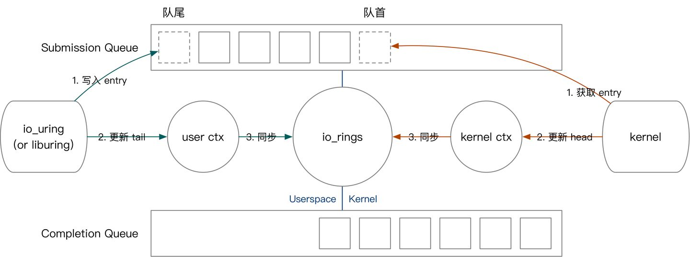
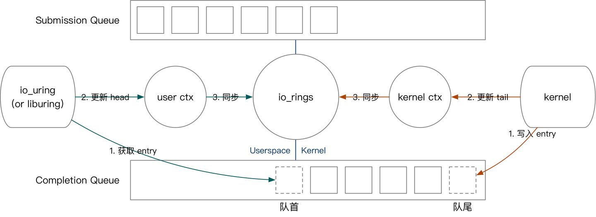

```c
//  CQE 是一个 16B 大小的结构体，包含操作的执行结果。
struct io_uring_cqe {
        __u64	user_data;	/* sqe->data submission passed back */
        __s32	res;		/* result code for this event */ // 执行结果
        __u32	flags; //没用到
};
```


```c
struct io_uring_sqe {
	__u8	opcode;		/* type of operation for this sqe */ // 
	__u8	flags;		/* IOSQE_ flags */
	__u16	ioprio;		/* ioprio for the request */
	__s32	fd;		/* file descriptor to do IO on */
	__u64	off;		/* offset into file */
	__u64	addr;		/* pointer to buffer or iovecs */
	__u32	len;		/* buffer size or number of iovecs */
	union {
		__kernel_rwf_t	rw_flags;
		__u32		fsync_flags;
		__u16		poll_events;
		__u32		sync_range_flags;
		__u32		msg_flags;
		__u32		timeout_flags;
	};
	__u64	user_data;	/* data to be passed back at completion time */ // 使用 io_uring 的程序都需要用到 64 位的 user_data 来唯一标识一个操作。user_data是 SQE 的一部分。io_uring 执行完某个操作后，会将这个操作的 user_data 和操作的返回值一起写入 CQ 中。


	union {
		__u16	buf_index;	/* index into fixed buffers, if used */
		__u64	__pad2[3];
	};
};

```

io_ring_ctx 是贯穿整个 io_uring 所有过程的数据结构，基本上在任何位置只需要你能持有该结构就可以找到任何数据所在的位置，这也就是前文所说的核外围绕 fd 做文章，而内核为了服务好 fd 而对应出一个 context 结构。

```c
struct io_ring_ctx {
        struct {
                struct percpu_ref       refs;
        } ____cacheline_aligned_in_smp;

        struct {
                unsigned int            flags;
                bool                    compat;
                bool                    account_mem;

                /* SQ ring */
                struct io_sq_ring       *sq_ring;
                unsigned                cached_sq_head;
                unsigned                sq_entries;
                unsigned                sq_mask;
                unsigned                sq_thread_idle;
                struct io_uring_sqe     *sq_sqes;
                struct list_head        defer_list;
        } ____cacheline_aligned_in_smp;

        /* IO offload */
        struct workqueue_struct *sqo_wq;
        struct task_struct      *sqo_thread;    /* if using sq thread polling */
        struct mm_struct        *sqo_mm;
        wait_queue_head_t       sqo_wait;
        struct completion       sqo_thread_started;

        struct {
                /* CQ ring */
                struct io_cq_ring       *cq_ring;
                unsigned                cached_cq_tail;
                unsigned                cq_entries;
                unsigned                cq_mask;
                struct wait_queue_head  cq_wait;
                struct fasync_struct    *cq_fasync;
                struct eventfd_ctx      *cq_ev_fd;
        } ____cacheline_aligned_in_smp;

         /*
          * If used, fixed file set. Writers must ensure that ->refs is dead,
          * readers must ensure that ->refs is alive as long as the file* is
          * used. Only updated through io_uring_register(2).
          */
         struct file             **user_files;
         unsigned                nr_user_files;
         /* if used, fixed mapped user buffers */
         unsigned                nr_user_bufs;
         struct io_mapped_ubuf   *user_bufs;
         struct user_struct      *user;
         struct completion       ctx_done;

         struct {
                 struct mutex            uring_lock;
                 wait_queue_head_t       wait;
         } ____cacheline_aligned_in_smp;

         struct {
                 spinlock_t              completion_lock;
                 bool                    poll_multi_file;
                 /*
                  * ->poll_list is protected by the ctx->uring_lock for
                  * io_uring instances that don't use IORING_SETUP_SQPOLL.
                  * For SQPOLL, only the single threaded io_sq_thread() will
                  * manipulate the list, hence no extra locking is needed there.
                  */
                 struct list_head        poll_list;
                 struct list_head        cancel_list;
         } ____cacheline_aligned_in_smp;

         struct async_list       pending_async[2];
 #if defined(CONFIG_UNIX)
         struct socket           *ring_sock;
 #endif
 };

```

要在 `io_uring` 中完成 `fsync` 操作，用户需要将 SQE 中的 opcode 设置为 IORING_OP_FSYNC，将 fd 设置为需要同步的文件，并填充 fsync_flags。其他操作也是类似，设置 opcode 并将操作所需要的参数并写入 SQE 即可。




我们的先以用户提交任务为例，介绍 io_uring 的内核用户交互方式。用户提交任务的过程如下：

1. 将 SQE 写入 SQEs 区域，而后将 SQE 编号写入 SQ。（对应图中绿色第一步）
2. 更新用户态记录的队头。（对应图中绿色第二步）
3. 如果有多个任务需要同时提交，用户不断重复上面的过程。
4. 将最终的队头编号写入与内核共享的 io_uring 上下文。（对应图中绿色第三步）

接下来我们简要介绍内核获取任务、内核完成任务、用户收割任务的过程。

内核态获取任务的方式是，从队尾读取 SQE，并更新 io_uring 上下文的 SQ tail。



1. 内核态完成任务：往 CQ 中写入 CQE，更新上下文 CQ head。
2. 用户态收割任务：从 CQ 中读取 CQE，更新上下文 CQ tail。


```c++

struct io_sqring_offsets {
        __u32 head;
        __u32 tail;
        __u32 ring_mask;
        __u32 ring_entries;
        __u32 flags;
        __u32 dropped;
        __u32 array;
        __u32 resv1;
        __u64 resv2;
};

/*
 * sq_ring->flags
 */
#define IORING_SQ_NEED_WAKEUP   (1U << 0) /* needs io_uring_enter wakeup */

struct io_cqring_offsets {
        __u32 head;
        __u32 tail;
        __u32 ring_mask;
        __u32 ring_entries;
        __u32 overflow;
        __u32 cqes;
        __u64 resv[2];
};

/*
 * io_uring_enter(2) flags
 */
#define IORING_ENTER_GETEVENTS  (1U << 0)
#define IORING_ENTER_SQ_WAKEUP  (1U << 1)

/*
 * Passed in for io_uring_setup(2). Copied back with updated info on success
 */
struct io_uring_params {
        __u32 sq_entries;
        __u32 cq_entries;
        __u32 flags;
        __u32 sq_thread_cpu;
        __u32 sq_thread_idle;
        __u32 resv[5];
        struct io_sqring_offsets sq_off;
        struct io_cqring_offsets cq_off;
};

```